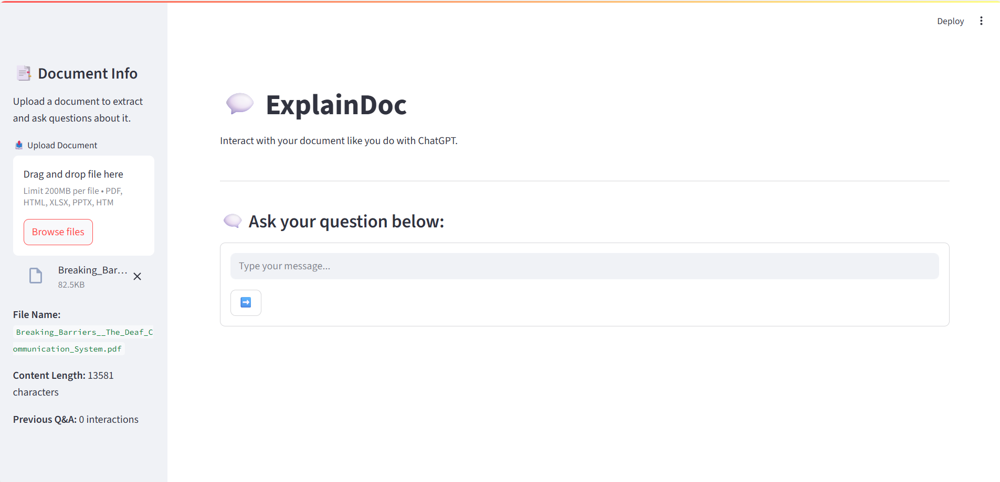
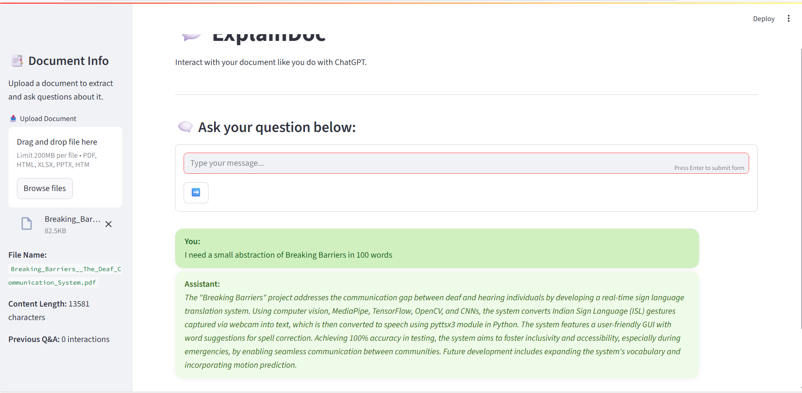

# 💬 ExplainDoc

A smart, responsive document question-answering chatbot using Google's Gemini API, Streamlit UI, and RAG (Retrieval-Augmented Generation) pipeline.

---

## 📄 Features

- 📁 Upload and analyze PDF, HTML, Excel, or PowerPoint documents
- 🤖 Ask natural questions about the document contents
- 🎨 Styled chat UI similar to ChatGPT (light green and white theme)
- 🧠 Maintains context with memory of previous questions
- 📊 Sidebar shows file details and Q&A history

---

## 🛠️ Setup Instructions

### 1. Clone the Repository

```bash
git clone https://github.com/your-username/rag-chatbot.git
cd rag-chatbot
```

---

## 🖼️ Screenshots

### 🔹 Initial Interface
A clean and responsive landing UI before uploading any files.


### 🔹 After Uploading a Document
Displays the sidebar with document details and chat area enabled.



### 🔹 Question and Answer Flow
Shows how the chatbot responds after a question is asked.



